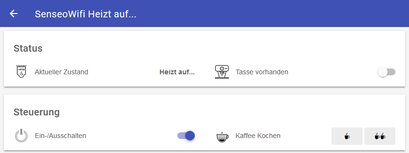
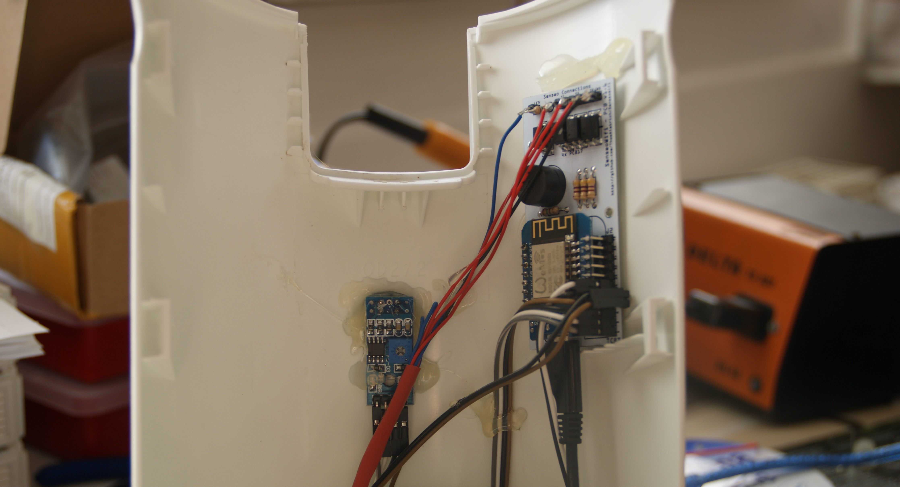
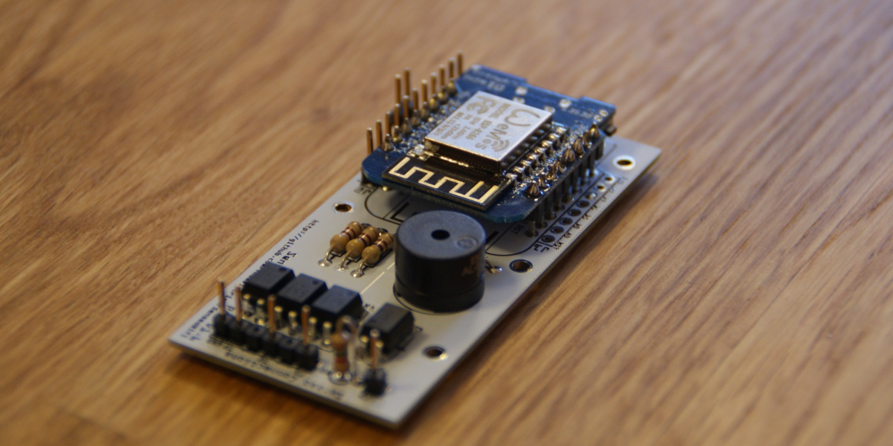
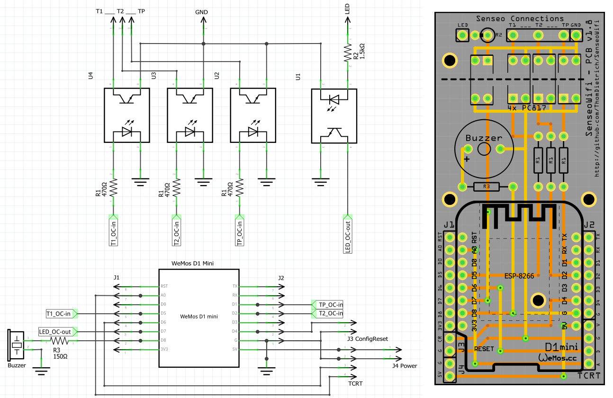

# SenseoWifi - Smart Home Coffee Maker

Wifi'ify the Senseo coffee maker.

The coffee maker is with no doubt a central element of our lives.
In the Smart Home where every device is connected and automated, the coffee making can not be left out.
Let's bring the [Philips Senseo](https://de.wikipedia.org/wiki/Senseo) (Basic or Classic) into your Wi-Fi and control it remotely from your smartphone, through automation, or by extension via Alexa!

> Yes, this is silly, you should do it too!

## Summary

This project contains information and material regarding:

- Soldering a **custom PCB** needed to bring Senseo onto a Wi-Fi
- Connecting the custom PCB to the Senseo PCB
- Compiling firmware with [PlatformIO](https://platformio.org/) (e.g. as plugin in [VisualStudioCode](https://code.visualstudio.com/))
- Flashing the custom PCB with the **provided firmware**
- Connecting to Wi-Fi and [MQTT](https://www.hivemq.com/mqtt-essentials)
- Connecting to [Home Assistant](https://www.home-assistant.io), [openHAB](https://openhab.org) or any other home automation solution, including voice assistants like [Amazon Alexa](https://en.wikipedia.org/wiki/Amazon_Alexa)
- Adding a buzzer for **audio feedback** *(optional)*
- Adding a **cup detector** for further automation *(optional)*



### Compatibility

This project is comatible with:

- Philips Senseo HD7810
- Philips Senseo HD7811
- Philips Senseo HD7812
- Philips Senseo HD7817
- Philips Senseo HD7865 Quadrante
- Philips Senseo HD7860 Quadrante
- … and most probably all similar models with one LED and three buttons



## Features

After implementing the steps below your Senseo coffee machine will offer the following new features.
This is especially useful in combination with a home automation system.

- Inform about the current state (Standby, Brewing, ...) of the machine
- Notify about an empty water tank
- Notify about a filled up coffee cup
- Remote control the machine via Wifi/MQTT commands
- Go through a complete brewing cycle automatically (Turn on, brew, turn off)
- Audio feedback via a built-in speaker
- Detect a cup via an optical sensor
- Collect usage statistics, e.g. stored in InfluxDB and visualized in Grafana

## Hardware Modification

The first challenge of this project is to hack the Senseo machine electronics.
You need to solder and connect a custom PCB to the machine.
In the end the PCB will not be visible from the outside, powered from the inside, connected via Wi-Fi and programmed over-the-air (OTA).

**⚠⚠⚠ Attention! For your own safety do not connect AC power while opened up. ⚠⚠⚠**

### Parts

| Part | Description |
|------|-------------|
| 1× Custom PCB | See [`SenseoWifi-PCB` folder](SenseoWifi-PCB) for schematic |
| 1× WeMos D1 Mini | Microcontroller, [learn more…](https://wiki.wemos.cc/products:d1:d1_mini) |
| 4× Sharp PC817 | Optocoupler interfacing with the Senseo board ([datasheet](http://www.sharp-world.com/products/device/lineup/data/pdf/datasheet/pc817xnnsz_e.pdf)). Thanks to these, the Senseo can be connected to AC power and to your PC via USB at the same time. Try to avoid this constellation and be cautious with active AC power. |
| 3× 470Ω Resistor | |
| 1× 1.5kΩ Resistor | |
| 1× Push button | To reset the microcontroller from the outside |
| 1× AC-DC Step Down Converter (220V to 5V) | As internally sourced power supply (e.g. [ebay.de](https://ebay.us/n9Cz6R) or [HLK-PM01](http://www.hlktech.net/product_detail.php?ProId=54)) |
| Generic male headers | A bunch of them |
| 1× Buzzer 12mm | *Optional* - Used for audio feedback, can be disabled in firmware (e.g. [reichelt.de](https://www.reichelt.de/Signalakustik/AL-60P01A/3/index.html?ACTION=3&GROUPID=6560&ARTICLE=145896&START=0&OFFSET=16&)) |
| 1× 150Ω Resistor | *Optional* - Size depends on buzzer |
| 1× TCRT5000 | *Optional* - To detect a cup. Reflective Optical Sensor, Regulated Module (e.g. [ebay.de](https://ebay.us/3Kf6fq)) |



**Power Consumption:**
The question was raised how much energy is consumed by the modification. The PCB consumes approx. 110mA.
Assuming the Senseo machine is connected to power 24/7, the additional electronics raise your electrical bill by 2.00€ per year.

### Steps

1. Solder the custom PCB according to the schematics provided in the `SenseoWifi-PCB` folder (designed in [Fritzing](http://fritzing.org))
2. Hot clue the custom PCB inside the Senseo machine in a free position [such as shown here](images/DSC09604.jpg)
3. Wire the custom PCB via the "Senseo Connections" header (angled pin headers recommended) to interface with the Senseo PCB. The solder pads to use for the LED, the buttons, and ground connection are shown on [this image](images/DSC09627.jpg) - pictures for the Quadrante in images folder.
4. Connect a simple push button (the configuration reset button) to J3 and hot clue in the [base of the Senseo housing](images/resetbutton.jpg).
5. Connect the additional [power supply](images/DSC09646.jpg) to the Senseo power cable and wire to J4
6. Prepare a [small cutout](images/tcrt-cutout.jpg) in the Senseo front and [hot clue from behind](images/DSC09604.jpg). Connect to the TCRT header
7. Connect a USB cable to continue with firmware programming. Do not connect AC power

Please follow the details given in the schematics and the pictures in the [images](images) folder, which should make everything pretty clear.
Do not hessitate to create a support ticket on GitHub if we missed anything.
A pull request to improve this README is always welcome.



## Firmware Upload

The WeMos microcontroller needs to be programmed with the code provided in this repository.
Be aware that the custom functionality is build on top of the excellent [Homie v3.0](https://github.com/homieiot/homie-esp8266/) framework.

An MQTT broker is needed in your network (e.g. mosquitto).

Please follow these instructions (last tested 2021-10-01):

1. Install PlatformIO via Visual Studio Code as decribed [here](https://platformio.org/platformio-ide) or upgrade your existing installation
2. Open PlatformIO and load a latest copy of this repository
3. Connect your Senseo via the USB cable to your PC (do not connect the Senseo to AC power!) and check the devices view of PlatformIO to verify
4. Transfer the firmware and the configuration web interface to the microcontroller.
  The full list of PlatformIO project tasks is:
   - Clean
   - Erase Flash
   - Build
   - Upload
   - Upload File System image
   - Monitor
  
   If any of the steps ends in a connection error dis- and reconnect the USB cable.
   You were successful when the monitoring terminal shows the SenseoWifi firmware version.
   For initial hardware testing see below.

5. Use a smartphone to connect to the provided Wifi, you will be redirected to a configuration web frontend
6. Provide your Wifi, MQTT, and other settings (we recommend the default homie base topic)
7. Use an MQTT client to inspect messages sent to the MQTT broker.
  You were successful when the message "senseo-wifi" is published to the topic `homie/senseo-wifi/machine/$name`
8. Disconnect the USB cable, close the Senseo housing, and connect the Senseo machine to AC power.
  The machine should once again start communicating via MQTT

**For Hardware testing:** A special piece of code is provided to test that your fresh hardware modifications are working.
Enable `testIO()` in `SenseoWifi.cpp` and check `testIO.cpp` for details.

**Configuration mode:** The configuration web frontend is only available when in configuration mode, i.e. when not yet configured.
Press the configuration reset button previously mounted in the base of the machine for 5 seconds to resets the firmware configuration.
The machine switches in configuration mode and provides a Wifi accesspoint, which upon connection once again presents the configuration web frontend.
Follow these instructions if you ever loose connection, or want to change your Wifi or MQTT settings.

### OTA Updates

After an initial flash with the firmware, updates can be sent via Wifi+MQTT, no need to take the machine apart.
The web frontend on flash and your custom configuration stay on the device.

```sh
python3 ota_updater_202011.py -l 192.168.0.75 -u user -d password -t "homie/" -i "senseo-wifi-rf21" .pio/build/senseo-wifi/firmware.bin
```

## Usage

If everything worked out your machine now communicates its status and accepts commands via MQTT.
You are now ready to interact with the machine and integrate it with other systems.
Please check the source code of `SenseoWifi.cpp` for details on states and commands. 

## Smart Home Integration

With the machine connected to Wifi and MQTT, you can now link a smart home system to the important MQTT topics to integrate the machine with the rest of your smart home.

### Home Assistant Configuration Example

The following example integrates the Senseo machine with the home automation solution Home Assistant.
The configuration adds all necessary entities, translations to German, and clever automations to make the machine useful.
E.g. one automation enables a complete coffee brewing cycle with a single command, the other reminds you of your warm coffee every minute while you didn't pick it up.

Please make sure the machine is connected to your MQTT broker and adapt the machine name in the topic.

Home Assistant config file `packages/senseo_wifi.yaml`:
```yaml
input_boolean:
  senseowifi_brew_normal:
    name: "SenseoWifi Auslöser einfache Tasse brühen"
    initial: off
    icon: mdi:coffee

  senseowifi_brew_double:
    name: "SenseoWifi Auslöser große Tasse brühen"
    initial: off
    icon: mdi:coffee

  senseowifi_brew_double_automated:
    name: "SenseoWifi Flag automatisch große Tasse brühen"
    initial: off
    icon: mdi:coffee

  senseowifi_buzzer_tone:
    name: "SenseoWifi Auslöser Buzzer Tone"
    initial: off
    icon: mdi:coffee

##############################################################################

switch:
  - platform: mqtt
    name: senseowifi_power
    unique_id: uniqueid__senseowifi_power
    icon: mdi:power
    #
    state_topic: "homie/senseo-wifi-rf21/machine/power"
    state_on: "true"
    state_off: "false"
    #
    command_topic: "homie/senseo-wifi-rf21/machine/power/set"
    payload_on: "true"
    payload_off: "false"
    #
    availability_topic: "homie/senseo-wifi-rf21/$state"
    payload_available: "ready"
    payload_not_available: "lost"

binary_sensor:
  - platform: mqtt
    name: senseowifi_out_of_water
    unique_id: uniqueid__senseowifi_out_of_water
    icon: mdi:water-off-outline
    #
    state_topic: "homie/senseo-wifi-rf21/machine/outOfWater"
    payload_on: "true"
    payload_off: "false"
    device_class: problem
    #
    availability_topic: "homie/senseo-wifi-rf21/$state"
    payload_available: "ready"
    payload_not_available: "lost"

  - platform: mqtt
    name: senseowifi_cup_available
    unique_id: uniqueid__senseowifi_cup_available
    icon: mdi:coffee-outline
    #
    state_topic: "homie/senseo-wifi-rf21/machine/cupAvailable"
    payload_on: "true"
    payload_off: "false"
    #
    availability_topic: "homie/senseo-wifi-rf21/$state"
    payload_available: "ready"
    payload_not_available: "lost"

  - platform: mqtt
    name: senseowifi_cup_full
    unique_id: uniqueid__senseowifi_cup_full
    icon: mdi:coffee
    #
    state_topic: "homie/senseo-wifi-rf21/machine/cupFull"
    payload_on: "true"
    payload_off: "false"
    #
    availability_topic: "homie/senseo-wifi-rf21/$state"
    payload_available: "ready"
    payload_not_available: "lost"

sensor:
  - platform: mqtt
    name: senseowifi_brewed_size
    unique_id: uniqueid__senseowifi_brewed_size
    icon: mdi:coffee-maker
    #
    state_topic: "homie/senseo-wifi-rf21/machine/brewedSize"
    #
    availability_topic: "homie/senseo-wifi-rf21/$state"
    payload_available: "ready"
    payload_not_available: "lost"

  - platform: mqtt
    name: senseowifi_opstate
    unique_id: uniqueid__senseowifi_opstate
    icon: mdi:state-machine
    #
    state_topic: "homie/senseo-wifi-rf21/machine/opState"
    #
    availability_topic: "homie/senseo-wifi-rf21/$state"
    payload_available: "ready"
    payload_not_available: "lost"

  ##############################################################################
  - platform: mqtt
    name: senseowifi_debug
    unique_id: uniqueid__senseowifi_debug
    icon: mdi:comment-text-multiple-outline
    #
    state_topic: "homie/senseo-wifi-rf21/machine/debug"
    #
    availability_topic: "homie/senseo-wifi-rf21/$state"
    payload_available: "ready"
    payload_not_available: "lost"
    #
    #entity_category: diagnostic

  - platform: mqtt
    name: senseowifi_rssi
    unique_id: uniqueid__senseowifi_rssi
    icon: mdi:signal-cellular-2
    #
    state_topic: "homie/senseo-wifi-rf21/$stats/signal"
    unit_of_measurement: "%"
    #
    availability_topic: "homie/senseo-wifi-rf21/$state"
    payload_available: "ready"
    payload_not_available: "lost"
    #
    #entity_category: diagnostic

  - platform: mqtt
    name: senseowifi_uptime
    unique_id: uniqueid__senseowifi_uptime
    icon: mdi:av-timer
    #
    state_topic: "homie/senseo-wifi-rf21/$stats/uptime"
    unit_of_measurement: "s"
    #
    availability_topic: "homie/senseo-wifi-rf21/$state"
    payload_available: "ready"
    payload_not_available: "lost"
    #
    #entity_category: system

  ##############################################################################

  - platform: template
    sensors:
      senseowifi_uptime_since:
        unique_id: uniqueid__senseowifi_uptime_since
        friendly_name: "SenseoWifi Letzter Neustart"
        value_template: >
          
            "unavailable"
          
            {{ ((as_timestamp(now() - timedelta(seconds=(states.sensor.senseowifi_uptime.state | int))) / 300) | round() * 300) | timestamp_local() }}
          
        icon_template: mdi:calendar-clock
        device_class: timestamp

##############################################################################

homeassistant:
  customize:
    switch.senseowifi_power:
      friendly_name: "SenseoWifi"
    binary_sensor.senseowifi_out_of_water:
      friendly_name: "SenseoWifi Wassertank leer Warnung"
    binary_sensor.senseowifi_cup_available:
      friendly_name: "SenseoWifi Tasse steht unter"
    binary_sensor.senseowifi_cup_full:
      friendly_name: "SenseoWifi Tasse voll"
    sensor.senseowifi_brewed_size:
      friendly_name: "SenseoWifi Zähler Kaffee-Brühungen (inkl. klein oder groß)"
    sensor.senseowifi_opstate:
      friendly_name: "SenseoWifi Operationszustand"
    sensor.senseowifi_debug:
      friendly_name: "SenseoWifi Debug-Nachrichten"
    sensor.senseowifi_uptime:
      friendly_name: "SenseoWifi Uptime"
    sensor.senseowifi_rssi:
      friendly_name: "SenseoWifi WLAN Signalstärke (RSSI)"

##############################################################################

automation:
  - id: "1611257531404"
    alias: Regel SenseoWifi Auslöser normale Tasse brühen
    trigger:
      platform: state
      entity_id: input_boolean.senseowifi_brew_normal
      to: "on"
    action:
      - service: mqtt.publish
        data:
          topic: "homie/senseo-wifi-rf21/machine/brew/set"
          payload: "1cup"
      - service: input_boolean.turn_off
        entity_id: input_boolean.senseowifi_brew_normal

  - id: "1611257531405"
    alias: Regel SenseoWifi Auslöser große Tasse brühen
    trigger:
      platform: state
      entity_id: input_boolean.senseowifi_brew_double
      to: "on"
    action:
      - service: mqtt.publish
        data:
          topic: "homie/senseo-wifi-rf21/machine/brew/set"
          payload: "2cup"
      - service: input_boolean.turn_off
        entity_id: input_boolean.senseowifi_brew_double

  - id: "1611257542501"
    alias: Regel SenseoWifi Auslöser Buzzer
    trigger:
      platform: state
      entity_id: input_boolean.senseowifi_buzzer_tone
      to: "on"
    action:
      - service: mqtt.publish
        data:
          topic: "homie/senseo-wifi-rf21/machine/buzzer/set"
          payload: "tone4" # 1, 2, 3, 4
      - service: input_boolean.turn_off
        entity_id: input_boolean.senseowifi_buzzer_tone

  ##############################################################################

  - id: "1611257542502"
    alias: Regel SenseoWifi Erinnerungston bei voller Tasse
    mode: single
    trigger:
      platform: state
      entity_id: binary_sensor.senseowifi_cup_full
      to: "on"
    action:
      - delay:
          minutes: 3
      - repeat:
          while:
            - condition: state
              entity_id: binary_sensor.senseowifi_cup_full
              state: "on"
          sequence:
            - service: mqtt.publish
              data:
                topic: "homie/senseo-wifi-rf21/machine/buzzer/set"
                payload: "tone3"
            - delay:
                minutes: 1

  ##############################################################################

  - id: "1610849760"
    alias: Regel Küche SenseoWifi Kaffee mit Ikea Shortcut-Taster
    trigger:
      platform: event
      event_type: zha_event
      event_data:
        unique_id: "68:0a:e2:ff:fe:2f:3a:db:1:0x0006"
    action:
      - service: input_boolean.toggle
        entity_id: input_boolean.senseowifi_brew_double_automated

  ##############################################################################

  - id: "1636231455732"
    alias: Regel Küche SenseoWifi ausschalten wenn zu lange im READY Zustand
    trigger:
      - platform: state
        entity_id: sensor.senseowifi_opstate
        to: "SENSEO_READY"
        for:
          minutes: 10
    action:
      - service: switch.turn_off
        entity_id: switch.senseowifi_power

  ##############################################################################

  - id: "1611257542601"
    alias: Regel SenseoWifi automatisch brühen (Schritt 1) Einschalten
    trigger:
      - platform: state
        entity_id: input_boolean.senseowifi_brew_double_automated
        to: "on"
    condition:
      - condition: state
        entity_id: switch.senseowifi_power
        state: "off"
    action:
      - service: mqtt.publish
        data:
          topic: "homie/senseo-wifi-rf21/machine/buzzer/set"
          payload: "tone4"
      - service: switch.turn_on
        entity_id: switch.senseowifi_power

  - id: "1611257542602"
    alias: Regel SenseoWifi automatisch brühen (Schritt 2) Brühen starten
    trigger:
      - platform: state
        entity_id: sensor.senseowifi_opstate
        to: "SENSEO_READY"
        for:
          seconds: 1 # let states settle
      - platform: state
        entity_id: input_boolean.senseowifi_brew_double_automated
        to: "on"
    condition:
      - condition: state
        entity_id: switch.senseowifi_power
        state: "on"
      - condition: state
        entity_id: binary_sensor.senseowifi_out_of_water
        state: "off"
      - condition: state
        entity_id: binary_sensor.senseowifi_cup_available
        state: "on"
      - condition: state
        entity_id: binary_sensor.senseowifi_cup_full
        state: "off"
      - condition: state
        entity_id: input_boolean.senseowifi_brew_double_automated
        state: "on"
    action:
      - service: mqtt.publish
        data:
          topic: "homie/senseo-wifi-rf21/machine/brew/set"
          payload: "2cup"

  - id: "1611257542603"
    alias: Regel SenseoWifi automatisch brühen (Schritt 3) Ausschalten
    trigger:
      platform: state
      entity_id: sensor.senseowifi_opstate
      from: "SENSEO_BREWING"
      for:
        seconds: 1 # let states settle
    condition:
      - condition: state
        entity_id: input_boolean.senseowifi_brew_double_automated
        state: "on"
    action:
      - service: switch.turn_off
        entity_id: switch.senseowifi_power

  - id: "1611257542604"
    alias: Regel SenseoWifi automatisch brühen (Schritt 4) Flag löschen
    trigger:
      platform: state
      entity_id: switch.senseowifi_power
      to: "off"
    condition:
      - condition: state
        entity_id: input_boolean.senseowifi_brew_double_automated
        state: "on"
    action:
      - service: input_boolean.turn_off
        entity_id: input_boolean.senseowifi_brew_double_automated

  - id: "1611257542605"
    alias: Regel SenseoWifi automatisch brühen (Schritt 5) Buzzerbestätigung
    trigger:
      platform: state
      entity_id: input_boolean.senseowifi_brew_double_automated
      to: "off"
    action:
      - service: mqtt.publish
        data:
          topic: "homie/senseo-wifi-rf21/machine/buzzer/set"
          payload: "tone4"

  ##############################################################################
```

Lovelace configuration for an interactive UI control in the Home Assistant app:
```yaml
cards:
  - type: entities
    entities:
      - entity: switch.senseowifi_power
        name: Power
      - type: conditional
        conditions:
          - entity: sensor.senseowifi_opstate
            state_not: SENSEO_OFF
        row:
          entity: sensor.senseowifi_opstate
          name: Operationszustand
  - type: conditional
    conditions:
      - entity: binary_sensor.senseowifi_out_of_water
        state: 'on'
    card:
      type: entities
      entities:
        - entity: binary_sensor.senseowifi_out_of_water
          name: Wassertank leer
  - type: conditional
    conditions:
      - entity: switch.senseowifi_power
        state: 'on'
      - entity: binary_sensor.senseowifi_out_of_water
        state_not: 'on'
      - entity: binary_sensor.senseowifi_cup_full
        state: 'off'
    card:
      type: entities
      entities:
        - entity: binary_sensor.senseowifi_cup_available
          name: Tasse steht unter
  - type: conditional
    conditions:
      - entity: binary_sensor.senseowifi_cup_full
        state: 'on'
    card:
      type: entities
      entities:
        - entity: binary_sensor.senseowifi_cup_full
          name: Tasse gefüllt
  - type: conditional
    conditions:
      - entity: sensor.senseowifi_opstate
        state: SENSEO_READY
      - entity: binary_sensor.senseowifi_cup_available
        state: 'on'
      - entity: binary_sensor.senseowifi_cup_full
        state: 'off'
    card:
      type: entities
      entities:
        - type: buttons
          entities:
            - entity: input_boolean.senseowifi_brew_normal
              name: kleine Tasse brühen
              icon: mdi:coffee-to-go
            - entity: input_boolean.senseowifi_brew_double
              name: große Tasse brühen
              icon: mdi:coffee-to-go
title: SenseoWifi
type: vertical-stack
```

### openHAB Configuration Example

The following openHAB configuration allows integration of the Senseo machine with the home automation solution openHAB. Please make sure the machine is connected to your MQTT broker. Insert the MQTT broker IP and replace "senseo-wifi-home" by your device name in the below example.

The [expire binding](https://www.openhab.org/addons/bindings/expire1/) is recommended for debug-value.

**Note:** Not updated to latest firmware changes. 

openHAB things file `mqtt.things`:
```
Bridge mqtt:systemBroker:LocalBroker [ host="your-broker-ip", secure=false ]
{
    Thing mqtt:topic:SenseoWiFi "SenseoWiFi" {
    Channels:
        Type string : Debug          "Debug"            [stateTopic="devices/senseo-wifi-home/machine/debug"]
        Type string : OpState        "Zustand"          [stateTopic="devices/senseo-wifi-home/machine/opState"]
        Type switch : OnOff          "OnOff"            [stateTopic="devices/senseo-wifi-home/machine/power", commandTopic="devices/senseo-wifi-home/machine/power/set", on="ON", off="OFF"]
        Type string : Brew           "Brew"             [stateTopic="devices/senseo-wifi-home/machine/brew",commandTopic="devices/senseo-wifi-home/machine/brew/set"]
        Type number : BrewedSize     "BrewedSize"       [stateTopic="devices/senseo-wifi-home/machine/brewedSize"]
        Type string : OutOfWater     "OutOfWater"       [stateTopic="devices/senseo-wifi-home/machine/outOfWater"]
        Type string : CupAvailable   "Tasse vorh."      [stateTopic="devices/senseo-wifi-home/machine/cupAvailable"]
        Type string : CupFull        "Tasse voll"       [stateTopic="devices/senseo-wifi-home/machine/cupFull"]
        Type string : Online         "Online"           [stateTopic="devices/senseo-wifi-home/$online"]

        Type string : version        "Version"          [ stateTopic="devices/senseo/$homie"]
        Type string : name           "Name"             [ stateTopic="devices/senseo/$name"]
        Type string : ip             "IP-address"       [ stateTopic="devices/senseo/$localip"]
        Type string : mac            "MAC-address"      [ stateTopic="devices/senseo/$mac"]
        Type string : fw_name        "Firmware Name"    [ stateTopic="devices/senseo/$fw/name"]
        Type string : fw_version     "Firmware Version" [ stateTopic="devices/senseo/$fw/version"]
        Type string : nodes          "Nodes"            [ stateTopic="devices/senseo/$nodes"]
        Type string : implementation "Implementation"   [ stateTopic="devices/senseo/$implementation"]
        Type string : interval       "Update interval"  [ stateTopic="devices/senseo/$stats/interval"]
    }
}
```

openHAB items file `SenseoWifi.items`:
```
String KU_Senseo_Debug         "Debug [%s]"                          {channel="mqtt:topic:SenseoWiFi:Debug", expire="10s"}
String KU_Senseo_OpState       "Zustand [MAP(senseo-wifi.map):%s]"   {channel="mqtt:topic:SenseoWiFi:OpState"}
Switch KU_Senseo_OnOff         "OnOff"                               {channel="mqtt:topic:SenseoWiFi:OnOff"}
String KU_Senseo_Brew          "Brew"                                {channel="mqtt:topic:SenseoWiFi:Brew"}
Number KU_Senseo_BrewedSize    "BrewedSize"                          {channel="mqtt:topic:SenseoWiFi:BrewedSize"}
String KU_Senseo_OutOfWater    "OutOfWater"                          {channel="mqtt:topic:SenseoWiFi:OutOfWater" [profile="transform:MAP", function="senseo-wifi.map"]}
String KU_Senseo_CupAvailable  "Tasse vorh."                         {channel="mqtt:topic:SenseoWiFi:CupAvailable" [profile="transform:MAP", function="senseo-wifi.map"]}
String KU_Senseo_CupFull       "Tasse voll"                          {channel="mqtt:topic:SenseoWiFi:CupFull" [profile="transform:MAP", function="senseo-wifi.map"]}
String KU_Senseo_Online        "Online"                              {channel="mqtt:topic:SenseoWiFi:Online"}
```

openHAB sitemap example `SenseoWifi.sitemap`:
```
sitemap testing label="Senseo-Tests"
{
    Text item=KU_Senseo_Online label="Fehler [Maschine nicht verfügbar!]" visibility=[KU_Senseo_Online == "false"] valuecolor=["false"="red"]
    Frame label="Status" visibility=[KU_Senseo_Online == "true"] {
        Text item=KU_Senseo_OpState label="Aktueller Zustand"
        Default item=KU_Senseo_Debug      label="Debug" visibility=[KU_Senseo_Debug != UNDEF] valuecolor=["red"]
        Text item=KU_Senseo_OutOfWater label="Wassertank [Leer]" visibility=[KU_Senseo_OpState == SENSEO_NOWATER] valuecolor=[ON="maroon"] icon="water"
        Switch item=KU_Senseo_CupAvailable label="Tasse vorhanden" icon="coffee_cup"
        Switch item=KU_Senseo_CupFull label="Tasse voll" visibility=[KU_Senseo_CupAvailable == ON] icon="coffee_cup_hot"
    }
    Frame label="Steuerung" visibility=[KU_Senseo_Online == "true"] {
        Switch item=KU_Senseo_OnOff label="Ein-/Ausschalten"
        Switch item=KU_Senseo_Brew label="Kaffee Kochen" mappings=[1cup="☕", 2cup="☕☕"]
    }
}
```

## Contribution

Further details outstanding. Don't hesitate to open a support issue!

Happy Hacking!

----

# Disclaimer and Legal

> *Philips* and *Senseo* are registered trademarks of *Philips GmbH*.
>
> This project is a community project not for commercial use.
> The authors will not be held responsible in the event of device failure or bad tasting coffee.
>
> This project is in no way affiliated with, authorized, maintained, sponsored or endorsed by *Philips* or any of its affiliates or subsidiaries.
