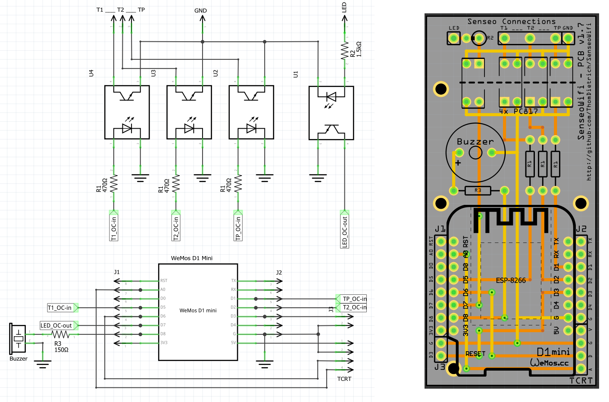

# SenseoWifi - Smart Home Coffee Maker

Wifi'ify the Senseo coffee maker.

The coffee maker is with no doubt a central element of our lives.
In the Smart Home where every device is connected and automated, the coffee making can not be left out.
Let's bring the [Philips Senseo](https://de.wikipedia.org/wiki/Senseo) (Basic or Classic) into your Wi-Fi and control it remotely!

> Yes, this is silly, you should do it too!

## Summary

This project contains information and material regarding:

- Soldering a **custom PCB** needed to bring Senseo onto a Wi-Fi
- Connecting the custom PCB to the Senseo PCB
- Compiling firmware with [PlatformIO](https://platformio.org/) (e.g. as plugin in [VisualStudioCode](https://code.visualstudio.com/))
- Flashing the custom PCB with the **provided firmware**
- Connecting to Wi-Fi and [MQTT](https://www.hivemq.com/mqtt-essentials)
- Connecting to [openHAB](https://openhab.org) (or any other home automation solution)
- *(optional)* Adding a buzzer for **audio feedback**
- *(optional)* Adding a **cup detector** for further automation


### Compatible with:

- Philips Senseo HD7810
- Philips Senseo HD7811
- Philips Senseo HD7812
- Philips Senseo HD7817
- … and most probably all similar models with one LED and three buttons

## Features

After implementing the steps below your Senseo will offer the following new features:

- Inform about the current state (Standby, Brewing, ...) of the machine
- Notify about an empty water tank
- Remote control the machine via MQTT
- Go through a complete brewing cycle automatically (Turn on, brew, turn off)
- Over-the-air (OTA) firmware update
- Audio feedback via a built-in speaker (optional)
- Detect a cup via an optical sensor (optional)
- Collect usage statistics

## Hardware Modification

The first challenge of this project is to hack the Senseo machine electronics.
You need to solder and connect a custom PCB to the machine.
In the end the PCB will not be visible from the outside, powered from the inside, connected via Wi-Fi and programmed via OTA.

**⚠⚠⚠ Attention! For your own safety do not connect AC power while opened up. ⚠⚠⚠**

### Parts

| Part | Description |
|------|-------------|
| 1× Custom PCB | See [`SenseoWifi-PCB` folder](SenseoWifi-PCB) for schematic |
| 1× WeMos D1 Mini | Microcontroller, [learn more…](https://wiki.wemos.cc/products:d1:d1_mini) |
| 4× Sharp PC817 | Optocoupler interfacing with the Senseo board ([datasheet](http://www.sharp-world.com/products/device/lineup/data/pdf/datasheet/pc817xnnsz_e.pdf)) |
| 3× 470Ω Resistor | |
| 1× 1.5kΩ Resistor | |
| 1× Push button | To reset the microcontroller from the outside |
| 1× AC-DC Step Down Converter (220V to 5V) | As internally sourced power supply (e.g. [ebay.de](https://ebay.us/n9Cz6R) or [HLK-PM01](http://www.hlktech.net/product_detail.php?ProId=54)) |
| Generic male headers | A bunch of them |
| 1× Buzzer 12mm | *Optional* - Used for audio feedback, can be disabled in firmware (e.g. [reichelt.de](https://www.reichelt.de/Signalakustik/AL-60P01A/3/index.html?ACTION=3&GROUPID=6560&ARTICLE=145896&START=0&OFFSET=16&)) |
| 1× 150Ω Resistor | *Optional* - Size depends on buzzer |
| 1× TCRT5000 | *Optional* - To detect a cup. Reflective Optical Sensor, Regulated Module (e.g. [ebay.de](https://ebay.us/3Kf6fq)) |


### Steps

1. Solder the custom PCB according to the schematics designed in [Fritzing](http://fritzing.org)
2. Wire the custom PCB to the Senseo PCB to interface with the Senseo LED and buttons
3. Add the optical sensor to the Senseo housing (optional)
4. Connect the additional power supply
5. Include a button accessible from the bottom to reset the firmware settings



For now, please follow the details given in the schematics and the pictures located in the [images](images) folder.

## openHAB Configuration Example

The following openHAB configuration allows integration of the Senseo machine with the home automation solution openHAB. Please make sure the machine is connected to your MQTT broker. Insert the MQTT broker IP and replace "senseo-wifi-home" by your device name in the below example.

### mqtt.things
```
Bridge mqtt:systemBroker:LocalBroker [ host="your-broker-ip", secure=false ]
{
    Thing mqtt:topic:SenseoWiFi "SenseoWiFi" {
    Channels:
        Type string : Debug          "Debug"            [stateTopic="devices/senseo-wifi-home/machine/debug"]
        Type string : OpState        "Zustand"          [stateTopic="devices/senseo-wifi-home/machine/opState"]
        Type switch : OnOff          "OnOff"            [stateTopic="devices/senseo-wifi-home/machine/power", commandTopic="devices/senseo-wifi-home/machine/power/set", on="ON", off="OFF"]
        Type string : Brew           "Brew"             [stateTopic="devices/senseo-wifi-home/machine/brew",commandTopic="devices/senseo-wifi-home/machine/brew/set"]
        Type number : BrewedSize     "BrewedSize"       [stateTopic="devices/senseo-wifi-home/machine/brewedSize"]
        Type string : OutOfWater     "OutOfWater"       [stateTopic="devices/senseo-wifi-home/machine/outOfWater"]
        Type string : Recipe         "Recipe"           [stateTopic="devices/senseo-wifi-home/machine/recipe",commandTopic="devices/senseo-wifi-home/machine/recipe/set"]
        Type string : CupAvailable   "Tasse vorh."      [stateTopic="devices/senseo-wifi-home/machine/cupAvailable"]
        Type string : CupFull        "Tasse voll"       [stateTopic="devices/senseo-wifi-home/machine/cupFull"]
        Type string : Online         "Online"           [stateTopic="devices/senseo-wifi-home/$online"]

        Type string : version        "Version"          [ stateTopic="devices/senseo/$homie"]
        Type string : name           "Name"             [ stateTopic="devices/senseo/$name"]
        Type string : ip             "IP-address"       [ stateTopic="devices/senseo/$localip"]
        Type string : mac            "MAC-address"      [ stateTopic="devices/senseo/$mac"]
        Type string : fw_name        "Firmware Name"    [ stateTopic="devices/senseo/$fw/name"]
        Type string : fw_version     "Firmware Version" [ stateTopic="devices/senseo/$fw/version"]
        Type string : nodes          "Nodes"            [ stateTopic="devices/senseo/$nodes"]
        Type string : implementation "Implementation"   [ stateTopic="devices/senseo/$implementation"]
        Type string : interval       "Update interval"  [ stateTopic="devices/senseo/$stats/interval"]
    }
}
```

### SenseoWifi.items
[expire binding](https://www.openhab.org/addons/bindings/expire1/) recommended for debug-value
```
String KU_Senseo_Debug         "Debug [%s]"                          {channel="mqtt:topic:SenseoWiFi:Debug", expire="10s"}
String KU_Senseo_OpState       "Zustand [MAP(senseo-wifi.map):%s]"   {channel="mqtt:topic:SenseoWiFi:OpState"}
Switch KU_Senseo_OnOff         "OnOff"                               {channel="mqtt:topic:SenseoWiFi:OnOff"}
String KU_Senseo_Brew          "Brew"                                {channel="mqtt:topic:SenseoWiFi:Brew"}
Number KU_Senseo_BrewedSize    "BrewedSize"                          {channel="mqtt:topic:SenseoWiFi:BrewedSize"}
String KU_Senseo_OutOfWater    "OutOfWater"                          {channel="mqtt:topic:SenseoWiFi:OutOfWater" [profile="transform:MAP", function="senseo-wifi.map"]}
String KU_Senseo_Recipe        "Recipe"                              {channel="mqtt:topic:SenseoWiFi:Recipe"}
String KU_Senseo_CupAvailable  "Tasse vorh."                         {channel="mqtt:topic:SenseoWiFi:CupAvailable" [profile="transform:MAP", function="senseo-wifi.map"]}
String KU_Senseo_CupFull       "Tasse voll"                          {channel="mqtt:topic:SenseoWiFi:CupFull" [profile="transform:MAP", function="senseo-wifi.map"]}
String KU_Senseo_Online        "Online"                              {channel="mqtt:topic:SenseoWiFi:Online"}
```

### SenseoWifi.sitemap
```
sitemap testing label="Senseo-Tests"
{
    Text item=KU_Senseo_Online label="Fehler [Maschine nicht verfügbar!]" visibility=[KU_Senseo_Online == "false"] valuecolor=["false"="red"]
    Frame label="Status" visibility=[KU_Senseo_Online == "true"] {
        Text item=KU_Senseo_OpState label="Aktueller Zustand"
        Default item=KU_Senseo_Debug      label="Debug" visibility=[KU_Senseo_Debug != UNDEF] valuecolor=["red"]
        Text item=KU_Senseo_OutOfWater label="Wassertank [Leer]" visibility=[KU_Senseo_OpState == SENSEO_NOWATER] valuecolor=[ON="maroon"] icon="water"
        Switch item=KU_Senseo_CupAvailable label="Tasse vorhanden" icon="coffee_cup"
        Switch item=KU_Senseo_CupFull label="Tasse voll" visibility=[KU_Senseo_CupAvailable == ON] icon="coffee_cup_hot"
    }
    Frame label="Steuerung" visibility=[KU_Senseo_Online == "true"] {
        Switch item=KU_Senseo_OnOff label="Ein-/Ausschalten"
        Switch item=KU_Senseo_Brew label="Kaffee Kochen" mappings=[1cup="☕", 2cup="☕☕"]
    }
}
```

Further details outstanding. Don't hesitate to open a support issue!

Happy Hacking!

----

# Disclaimer and Legal

> *Philips* and *Senseo* are registered trademarks of *Philips GmbH*.
>
> This project is a community project not for commercial use.
> The authors will not be held responsible in the event of device failure or bad tasting coffee.
>
> This project is in no way affiliated with, authorized, maintained, sponsored or endorsed by *Philips* or any of its affiliates or subsidiaries.
