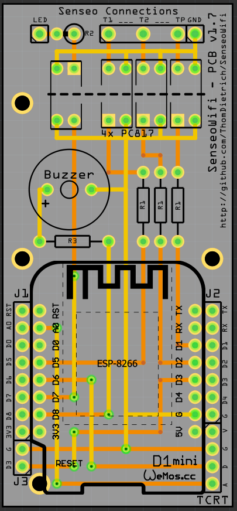

# SenseoWifi - Smart Home Coffee Maker

Wifi'ify the Senseo coffee maker.

The coffee maker is with no doubt a central element of our lives.
In the Smart Home where every device is connected and automated, the coffee making can not be left out.
Let's bring the [Philips Senseo](https://de.wikipedia.org/wiki/Senseo) (Basic or Classic) into your Wi-Fi and control it remotely!

> Yes, this is silly, you should do it too!

## Summary

This project contains information and material regarding:

- Soldering a **custom PCB** needed to bring Senseo onto a Wi-Fi
- Connecting the custom PCB to the Senseo PCB
- Flashing the custom PCB with the **provided firmware**
- Connecting to Wi-Fi and [MQTT](https://www.hivemq.com/mqtt-essentials)
- Connecting to [openHAB](https://openhab.org) (or any other home automation solution)
- *(optional)* Adding a buzzer for **audio feedback**
- *(optional)* Adding a **cup detector** for further automation

### Compatible with:

- Philips Senseo HD7810
- Philips Senseo HD7811
- Philips Senseo HD7812
- Philips Senseo HD7817
- … and most probably all similar models with one LED and three buttons

## Features

After implementing the steps below your Senseo will offer the following new features:

- Inform about the current state (Standby, Brewing, ...) of the machine
- Notify about an empty water tank
- Remote control the machine via MQTT
- Go through a complete brewing cycle automatically (Turn on, brew, turn off)
- Over-the-air (OTA) firmware update
- Audio feedback via a built-in speaker (optional)
- Detect a cup via an optical sensor (optional)
- Collect usage statistics

## Hardware Modification

The first challenge of this project is to hack the Senseo machine electronics.
You need to solder and connect a custom PCB to the machine.
In the end the PCB will not be visible from the outside, powered from the inside, connected via Wi-Fi and programmed via OTA.

**⚠⚠⚠ Attention! For your own safety do not connect AC power while opened up. ⚠⚠⚠**

### Parts

| Part | Description |
|------|-------------|
| 1× Custom PCB | See [`SenseoWifi-PCB` folder](SenseoWifi-PCB) for schematic |
| 1× WeMos D1 Mini |  |
| 4× Sharp PC817 | Optocoupler interfacing with the Senseo board (e.g. [ebay.de](http://r.ebay.com/FofSOY)) |
| 3× 470Ω Resistor | |
| 1× 1.5kΩ Resistor | |
| 1× Push button | To reset the microcontroller from the outside |
| Generic male headers | A bunch of them |
| 1× Step Down AC-DC Converter (220V to 5V) | As power supply internally sourced (e.g. [ebay.de](http://r.ebay.com/rSZMfO)) |
| 1× Buzzer 12mm | *Optional* - Used for audio feedback, can be disabled in firmware (e.g. [reichelt.de](https://www.reichelt.de/Signalakustik/AL-60P01A/3/index.html?ACTION=3&GROUPID=6560&ARTICLE=145896&START=0&OFFSET=16&)) |
| 1× 150Ω Resistor | *Optional* - Size depends on buzzer |
| 1× TCRT5000 | *Optional* - To detect a cup. Reflective Optical Sensor, Regulated Module (e.g. [ebay.de](http://r.ebay.com/M1Iuci)) |

### Steps

1. Solder the custom PCB according to the schematics
2. Wire the custom PCB to the Senseo PCB to interface with the Senseo LED and buttons
3. Add the optical sensor to the Senseo housing (optional)
4. Connect the additional power supply
5. Include a button accessible from the bottom to reset the firmware settings

For now, please follow the pictures of the end result located in the [images](images) folder.
Further details outstanding. Don't hesitate to open a support issue!

Happy Hacking!

----

#### Disclaimer and Legal

> *Philips* and *Senseo* are registered trademarks of *Philips GmbH*.
>
> This project is a community project not for commercial use.
> The authors will not be held responsible in the event of device failure or bad tasting coffee.
>
> This project is in no way affiliated with, authorized, maintained, sponsored or endorsed by *Philips* or any of its affiliates or subsidiaries.
